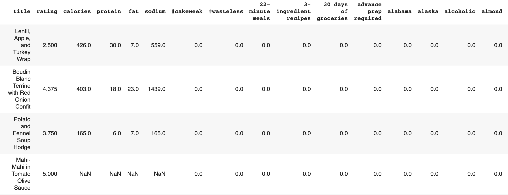

# Recipe Recommender System Project

Build a recipe reccomender system that recommends recipes based on nutrition metrics and ingredients.

Maintaining good eating habits is one of the best things a person can do for their wallet and health. Each year diabetes costs Americans $327 billion in medical fees and lost work and wages. Moreover, it is the 7th leading cause of death in America. More than 88 million US adults have Prediabetes-the precursor to diabetes 2,  which through lifestyle changes can be reversed. The goal of this project is to build a recipe reccomender system that helps people be more nutrition conscious with less effort.
 
</img>

# DATA:

The data for this project is sourced from two places
1) Recipes - Kaggle (https://www.kaggle.com/hugodarwood/epirecipes) - Each recipe name is tokenized then later used as input for API calls.

2) Recipes - Edamam API (https://developer.edamam.com/edamam-recipe-api) - Each observation is a recipe that has 28 measures for nutrition metrics, and other staple recipe information i.e. cook time.

# DATA ANALYSIS:

# 1. Data Collection:
In this step I collect, synthesize, and store recipe data.

# 2. Data Cleaning:
In this step I clean columns, handle nulls, and scale

# 3. Exploratory Analysis:
In this step recipe features are explored and visualized.

# 4. NLP Cleaning:
In this step NLP cleaning of recipes takes place.

# 5. Reccomender System:
In this step I build a system that reccomends recipes from my dataset that come closest to the desired nutrition meterics and ingredients specified by users.

### *For results, limitations, and takeaways scroll to bottom*

-----------------------------------------------------------------------------------------------------------

# 1. Data Collection 
The following steps were preformed using Python functionalities

- Load Kaggle Dataset
</img>

- Tokenize recipe names for 1 and 2 grams
- Get most common words 
- Store select words in a list
- Input a word from the list to make a single API call 
- Automate calls for remaining words then store and download each call as a CSV file
- Join CSV sheets into one master DF

</img>

### Conclusion: Queried Edamam Recipe API 230 times and collected 22,686 recipes. 

# 2. Data Cleaning:
**Step 1 : Clean columns**
The following steps were preformed using Pandas

- Drop "unamed", "bookmarked", and "bought" columns
- Use regex to drop columns that have "unit" and "label" in the title
- Rename columns of interest
- Drop remaining obsolete columns 
- Add column "q" the retains the word used to query each recipe
 
- The df 
</img>
 
**Step 2 : Handle nulls**
- Drop "Added_Sugar(g)" because 73% is missing and the information is embedded in "Sugar(g)" column
- Fill "Trans_Fat(g)" nulls with the remainder of subtracting monounsaturated, saturated, and polyunsarturated fat columns from "Fat(g)"
- Of the vitamin columns containing nulls less than .5% of entries are missing so fill with 0

**Step 3 : Scale**
- standardize nutrition metrics for serving size of 2 
 
# 3. Exploratory Analysis
- I divide the analysis into the following parts:

**A) Shape Analysis**: distribution, outliers

**B) Label Analysis**: diet labels, health labels

**C) Source Analysis**: id recipe sources and frequency

## A) Shape Analysis :
**Step 1 : Explore distributions**
The following steps are preformed using pandas functionalities

- Plot histograms
</img>

### Conclusion: Distributions are not normal.

## A) Shape Analysis :
**Step 2 : Explore outliers**

In this step, I visualize the previous findings using plotly.express 

- Plot boxplots
</img>

### Conclusion: All metrics have outliers.

## A) Shape Analysis :
**Step 3 : Compile overview of data**

- Create Pandas Profiling report 

</img>

### Conclusion: American Vodkas account for nearly half of all sales

## B) Label Analysis :
**Step 1 : Analyze diet labels**

In this step, I explore and visualize diet labels using plotly and seaborn

</img>

### Conclusion: Most recipes have no diet labels; ['High-Protien', 'Low-Carb'] tags are often used together. 

</img>

### Conclusion: 'Low-Carb' is the most frequently occuring diet label, and 'High-Protien' is the least frequently occuring diet label. 

## B) Label Analysis :
**Step 2 : Analyze health labels**

In this step, I explore and visualize diet labels using seaborn

</img>

### Conclusion: 'Alcohol-Free', 'Peanut-Free', and 'Tree-Nut-Free' are the most frequently occuring diet labels. 

## C) Source Analysis :
**Step 1 : Exploring the data**
In this step, I preformed the following using pandas functionalities

- Group DataFrame by county, summing for the total amount of liquor sold in gallons, and taking the mode for relevant population statics
- Examine the relationship between population demographics per county and sales

## C) Source Analysis :
**Step 2 : Visualizing the data**

In this step, I visualized the previous findings using ploty.express

</img>

### Conclusion: Sales are highly correlated to the percent of educated population under 25.

# 4. NLP Cleaning:
The following steps use NLP to clean recipe ingredients and were preformed using Pandas

- Remove all words after first comma 
- Define list of ingredient amounts and noise words
- Remove all words in list and words that are not .isalpha()
- Remove all adverbs and past tense, present participle, and past participle verbs; lemnmatize
 

# 5. Reccomender System:

**Step 1 : Build Model**
- Filter out recipes containing ingredients user is allergic to (if specified)
- Scale for serving size 
- Subset columns user specified input for
- Vectorize subset of columns for master df 
- Define nearest neighbor
- Vectorize users' seach input
- Return nearest neighbors to users' search

**Step 2 : Test different vectorizers**
- TF-IDF
- BOW 

**Step 3 : Select Best Model**
- Compare recipe returns and select best model
  
-----------------------------------------------------------------------------------------------------------

# BOW Model Results :
- HOEM distance meteric
  * Training Score: 0.999, Test Score: 0.996
  * RMSE: 17357.78 (0.09% of total sales)
- Cosine distance meteric 
  * Training Score: 0.999, Test Score: 0.996
  * RMSE: 17357.78 (0.09% of total sales)
- Minkowski distance meteric
  
# Analysis Takeaways :
- Cosine: good for returning similar ingredient(s) input
- Minkowski: good for returning recipes with similar nutrition input
- HEOM (works like FAMD): takes significantly longer time to run, but serves as a decent median between cosine and minkowski distances

# Going Foward :
- Run and test more queries with different distance metrics
- Add more recipes to df (esp. 'High-Protien')
- Explore deploying with Flask

width="740" height="300"
